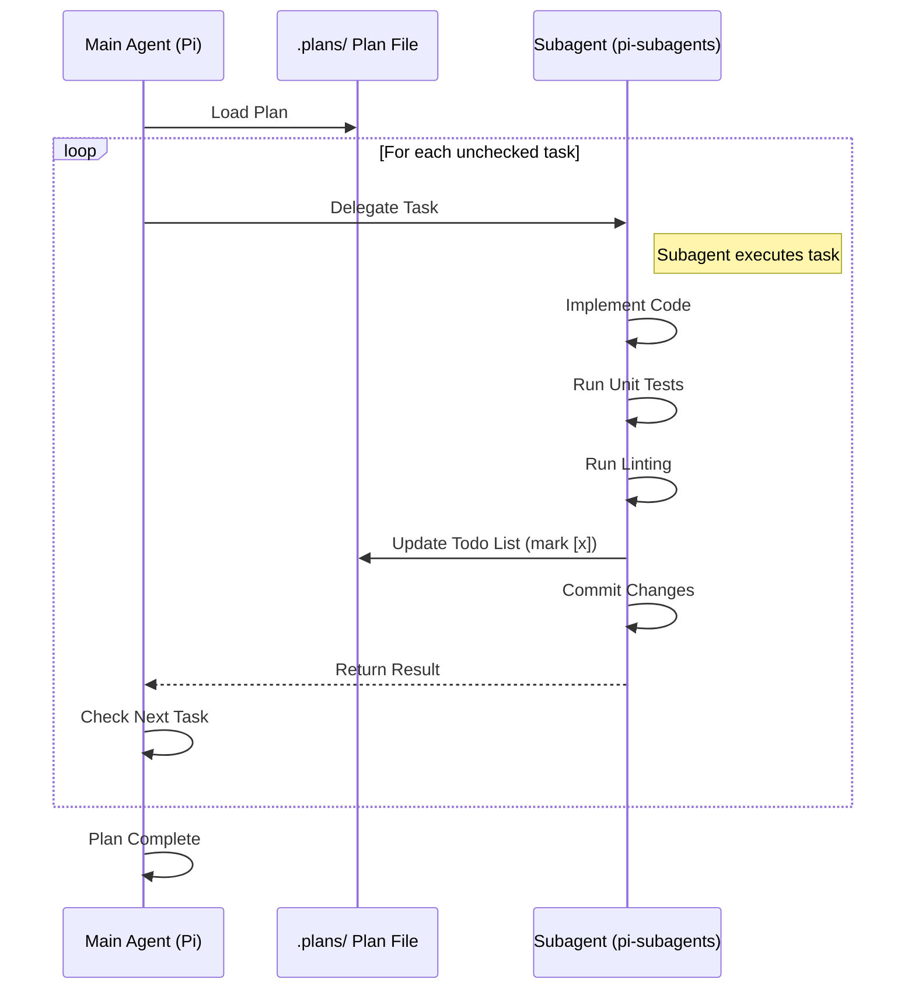

# 📋 Planning Skill

## 🚀 Trigger
Ative esta skill sempre que:
- Você precisar criar um plano técnico para uma feature ou correção.
- Você estiver executando um plano definido em `.plans/`.
- Você precisar quebrar uma solicitação complexa em passos menores e implementáveis.

## 📂 Armazenamento
Todos os planos devem ser salvos no diretório `.plans/`.
- Convenção de nomes: `PLANO-<FEATURE>.md`.

## 🧠 Princípios Core

1. **Quebre em pequenas tarefas (Atomic Tasks)**: Divida features grandes em tarefas pequenas e autônomas que um subagent pode executar isoladamente (ex: "Criar migração DB", "Atualizar API route", "Corrigir componente").
2. **Clareza visual**: Sempre inclua um diagrama visual (Mermaid) explicando a arquitetura ou o fluxo.
3. **Rastreabilidade**: Mantenha uma `Todo List` clara com checkboxes para rastrear o status.
4. **Isolamento**: As tarefas devem ser independentes o suficiente para serem trabalhadas em paralelo ou sequência sem bloqueios desnecessários.

## 📐 Estrutura do Plano

Todo plano em `.plans/` deve seguir esta estrutura:

1. **Título e Objetivo**: O que estamos construindo?
2. **Diagrama Visual**: Diagrama Mermaid da arquitetura/fluxo.
3. **Todo List**: Lista de tarefas atômicas com checkboxes (ex: `- [ ] Tarefa 1`).
4. **Detalhamento das Tarefas**: Instruções específicas para cada tarefa (arquivos a criar/modificar, lógica a implementar, critérios de aceitação).
5. **Ordem de Execução**: Sequência recomendada (ex: `1.1 -> 1.2 -> 2.1`).

## 🔄 Fluxo de Execução (O Loop)

Ao executar um plano, o Pi (agente principal) deve orquestrar um loop utilizando `pi-subagents`:



### Passos para o Agente Principal (Pi):
1. **Read**: Leia o plano em `.plans/`.
2. **Select**: Selecione a primeira tarefa não marcada.
3. **Delegate**: Delegue a tarefa para um subagent `pi-subagents` com as instruções específicas do plano.
4. **Wait**: Aguarde o subagent terminar.
5. **Verify**: Verifique os resultados (os testes passaram? o lint passou?).
6. **Update**: Atualize o arquivo do plano (mude `- [ ]` para `- [x]`).
7. **Commit**: Confirme o progresso (ou garanta que o subagent fez o commit).
8. **Repeat**: Repita até que todas as tarefas estejam concluídas.

## 📝 Formato de Tarefa no Plano

Para cada tarefa no plano, inclua:

```markdown
#### **Tarefa X.Y** — Breve descrição

**Arquivo(s)**: `caminho/para/arquivo.ts` (novo ou modificado)

**O que fazer**:
1. Passo 1...
2. Passo 2...

**Critérios de aceitação**:
- Critério 1...
- Critério 2...
```

## ⚠️ Regras de Execução

- **Sempre** execute testes unitários após cada tarefa.
- **Sempre** rode linting antes de comitar.
- **Sempre** atualize a `Todo List` no arquivo do plano após completar uma tarefa.
- **Nunca** pule tarefas mesmo que pareçam óbvias.
- **Garanta** que o subagent commite as mudanças antes de retornar ao loop principal.
